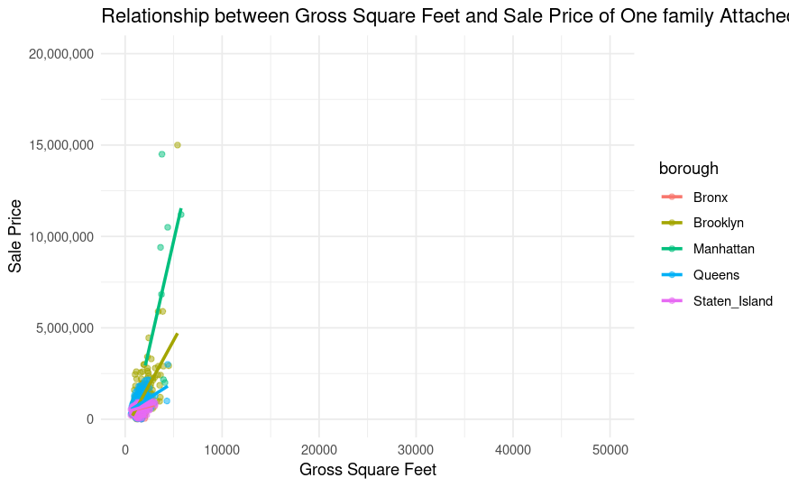

# one family dwelling-prediction

# Information
This is a linear regression project with aim of exploring one family attached or semi-detached residences in NYC. My interest was piqued after listening to a conversation on hot97 fm about the NYC housing crisis and as a student currently studying methods of data analysis in regression I felt this was a useful topic for practice.

# Storyline
I am a data analyst hired by a real estate investment firm. My task is to analyze the relationship between one family dwelling home size (gross square footage) and sale price in each borough to identify potential investment opportunities in one family attached residences.

## Dataset

The [data](https://www.nyc.gov/site/finance/property/property-rolling-sales-data.page) used was the Department of Finance’s rolling sales files list tax class 1, 2, and 4 properties that have sold in the last 12-month period in New York City in 2024. These files include the neighborhood, building type, square footage, and other data.

I'm going to use R studio, Excel to answer these question

# ASK phase

## Guiding Questions

The purpose of this Project is to explore the following questions:

* How Well does the Size of a One family attached homes in New York City Explain Sale Price?

* How well does the size of a One family attached homes(measured in gross square feet) explain or predict sale price across New York City as a whole?

To answer this, I'll explore property sales data for all five boroughs combined.

# Analysis phase

* How well does the size of a condominium explain or predict sale price for each individual borough?
  
For this question, I'll build, analyze, and compare linear models for each borough.

# Correlation between Sale Price and Size in Gross Square Feet

### General Trend:
* Positive Correlation: In general, as Gross Square Feet increases, the Sale Price also increases, which aligns with expectations.

## Interpretation
* The graph shows the relationship between the size of one-family attached homes (measured in gross square feet) and their sale price in different boroughs of New York City (NYC).

### General Observations:

* Positive Correlation: In all boroughs, there is a clear positive correlation between size and sale price. This means that larger homes generally sell for higher prices.
Linear Trend: The blue lines represent the best-fit lines which indicate a roughly linear relationship between size and price in each borough.

### Borough-Specific Observations:

* Manhattan: Homes in Manhattan have the highest sale prices overall and the steepest slope in the line, indicating a stronger relationship between size and price compared to other boroughs.
* Brooklyn: Shows a similar trend to Manhattan, with high prices and a steep slope.
* Queens: Also shows a positive correlation, but the slope is less steep than Manhattan and Brooklyn, suggesting that price increases less dramatically with size in Queens.
* Bronx: Homes in the Bronx have the lowest sale prices overall. The slope is less steep than Manhattan and Brooklyn, indicating a weaker relationship between size and price.
* Staten Island: Shows a positive correlation with a moderate slope, indicating a relationship between size and price that is less pronounced than in Manhattan and Brooklyn but more so than in the Bronx.

## Coefficient results

This table summarizes the linear regression results for predicting sale_price based on gross_square_feet across different NYC boroughs. Let's analyze the results:

###  Statistical Analysis 

1. Price per Square Foot (Slope)
Manhattan has the highest price per square foot ($3,538.98), which aligns with expectations since it's the most expensive borough.
Brooklyn comes next ($969.61), suggesting a high but significantly lower price per square foot compared to Manhattan.
Queens ($338.06), Bronx ($132.47), and Staten Island ($157.03) have much lower price increases per square foot.

3. Model Fit (R-Squared)
Brooklyn (0.366): Best model fit, meaning gross_square_feet explains 36.6% of the variation in sale price.
Queens (0.181), Manhattan (0.168), Staten Island (0.134), Bronx (0.065): Weaker fits, meaning other factors (like location, amenities, or building type) play a major role. To expand and improve upon the accuracy of the model I will need to add more predictor variables.

5. Intercept Interpretation
Brooklyn and Manhattan have large negative intercepts:
This suggests that at very low square footage values, the model predicts unrealistically negative sale prices.
This might indicate that a non-linear model (e.g., log-transformation or polynomial regression) would work better.

# Investor Reccommendations

Based on the findings of the linear models.

✅ Investment Implication:
Luxury investors should focus on Manhattan and Brooklyn for premium properties with strong demand.
Value investors should consider Queens, Bronx, and Staten Island where property values are lower but could appreciate over time.

### 1. Model Fit (R-Squared) = Predictability of Returns
   
* Brooklyn (0.366 R²) → Square footage is a relatively strong predictor of price. Investors can estimate property values more reliably.
* Queens (0.181), Manhattan (0.168), Staten Island (0.134), Bronx (0.065) → Lower R² means price depends on other factors (e.g., location within borough, amenities, transit access).

✅ Investment Implication:
* In Brooklyn, square footage matters more—bigger properties tend to have more predictable pricing.
* In Manhattan and the Bronx, other factors like neighborhood, building type, and amenities are key. Due diligence is needed before assuming appreciation.

However:

### 2. Intercept = Baseline Property Costs
* The large negative intercepts in Brooklyn (-533,579) and Manhattan (-4,554,742) suggest that at very small square footages, the model underestimates actual market prices.
In practice, no property sells for $0, and small apartments tend to have higher price-per-square-foot values.

✅ Investment Implication:
* For smaller units, the model might not be accurate—investors should supplement with real market comparables.
* Larger homes tend to follow the trend more predictably.

